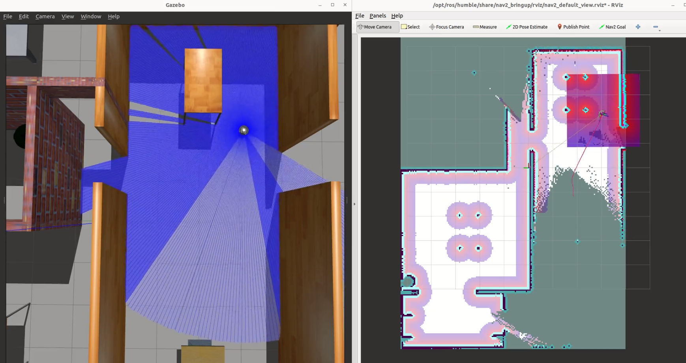

# TurtleBot3 Complete Sanitization System (ROS2 Project)

[](https://www.python.org/)  
[](https://docs.ros.org/en/humble/index.html)

Autonomous exploration, mapping, navigation, and sanitization of unknown environments using TurtleBot3 Burger and ROS2 Humble.

---

## 📌 Project Info
- 🎓 Course: Autonomous and Mobile Robotics
- 🏫 University of Bologna
- 📅 Year: 2023/2024

---

## 🧠 About the Project

This project implements a full autonomous robotic solution for indoor environments. Starting from an **unknown map**, the robot can **explore**, **map**, **localize**, **navigate through rooms**, and perform complete **UV-based sanitization** without human intervention. 

The system is based on:
- TurtleBot3 Burger (Gazebo Simulation)
- ROS2 Humble Middleware
- Python custom nodes for behavior orchestration
- Explore Lite and Nav2 for mapping and localization
- Boustrophedon Decomposition for systematic sanitization

It ensures real-time adaptability, energy saving during navigation, and a highly modular architecture suitable for different maps and tasks.

---

## 🗂 Project Structure

```
📦 ros2_ws/
┣ 📁 src/my_robot_controller/
┃ ┣ 💻 complete_sanitization.py       # Core controller node
┃ ┣ 💻 velocity_control_FSM.py        # FSM-based low-level obstacle avoidance
┃ ┣ 📁 maps/                          # Stored PGM + YAML maps
┃ ┗ 📄 README.md                      # You are here!
┣ 📁 images/                          # Images for documentation
┣ 📁 install/
┣ 📁 build/
┣ 📁 log/
┣ 📄 AMR_Project_Presentation.pdf
┣ 📄 sanitizer_project.pdf
```

---

## ⚙️ How to Run

### Setup Workspace
```bash
cd ros2_ws/
colcon build --symlink-install
. install/setup.bash
```

### Set TurtleBot3 Model
```bash
export TURTLEBOT3_MODEL=burger
```

---

## 🗺️ Maps and Modularity

The project includes two different environments:

- `my_map_house.pgm`
- `my_map_big_house.pgm`

📸 Maps:
<p align="center">
  
  
</p>

Both are used to test the generality and versatility of the system: by simply selecting the map name and task via the CLI, the behavior dynamically adapts. The system's design allows fast switching between different environments without code modifications — only user selection at runtime is needed.

## 🎯 Main Tasks

### 1. Obstacle Avoidance (FSM Control)

The robot uses a **finite state machine** to autonomously avoid obstacles. This behavior enables preliminary movement testing without navigation stack dependencies.

- **Launch Gazebo** (Terminal 1):
  ```bash
  export TURTLEBOT3_MODEL=burger
  ros2 launch turtlebot3_gazebo turtlebot3_house.launch.py x_pose:=-2.0 y_pose:=1.0
  ```
- **Start Obstacle Avoidance Node** (Terminal 2):
  ```bash
  ros2 run my_robot_controller velocity_control_FSM
  ```

📸 Localization:
<p align="center">
  
</p>

🛡️ The FSM logic includes forward movement, rotation upon obstacle detection, and safe environment exploration.

---

### 2. Simultaneous Localization and Mapping (SLAM)

This phase enables the robot to autonomously explore unknown environments and generate a map.

- **Gazebo launch** (Terminal 1)
- **RVIZ and SLAM launch** (Terminal 2):
  ```bash
  ros2 launch turtlebot3_navigation2 navigation2.launch.py use_sim_time:=True slam:=True
  ```
- **Start Exploration (Explore Lite)** (Terminal 3):
  ```bash
  ros2 launch explore_lite explore.launch.py return_to_init:=True
  ```
- **Save map once finished** (Terminal 4):
  ```bash
  ros2 run nav2_map_server map_saver_cli -f maps/house_map
  ```

📸 SLAM:
<p align="center">
  
</p>

🗺️ The Explore Lite package enables real-time frontier-based exploration, mapping the entire environment without manual goal setting.

---

### 3. Autonomous Navigation on Known Map

After building a map, the robot can autonomously navigate to specific locations using **AMCL** for localization.

- **Gazebo launch** (Terminal 1)
- **Load Map and Navigation stack** (Terminal 2):
  ```bash
  ros2 launch turtlebot3_navigation2 navigation2.launch.py use_sim_time:=True map:=<path_to_saved_map>.yaml
  ```
- **Launch complete_sanitization.py** (Terminal 3):
  ```bash
  ros2 run my_robot_controller complete_sanitization
  ```
  Then **type**:
  ```
  Navigation
  House
  ```
  
📸 Navigation:
<p align="center">
  
</p>

🧭 The robot localizes by monitoring pose covariance in real time and sequentially moves through the center coordinates of rooms.

---

### 4. Autonomous Sanitization

This task extends navigation to include room sanitization, employing systematic coverage.

- **Gazebo + RVIZ launch** as above.
- **Launch complete_sanitization.py**:
  ```bash
  ros2 run my_robot_controller complete_sanitization
  ```
  Then **type**:
  ```
  Sanitization
  House
  ```

📸 Localization:
<p align="center">
  
</p>

🛡️ Using the **Boustrophedon decomposition algorithm**, the robot covers every square meter of the room by moving along parallel tracks while activating the UV lamps.

---

## 🛠 Technologies and Tools

- **ROS2 Humble**
- **Gazebo Simulator**
- **TurtleBot3 Burger**
- **Python**
- **Explore Lite Package** for exploration
- **Navigation2 (Nav2)** for AMCL localization and path planning
- **Boustrophedon Decomposition** for sanitization

---

## 📊 Features

- **Interactive Experience**:  
  User selects map and task type at runtime.

- **Map Independence**:  
  Supports any custom map through parameterized config files.

- **Autonomous Localization**:  
  Robot automatically localizes using **Adaptive Monte Carlo Localization (AMCL)** and monitors covariance in real-time.

- **Navigation**:  
  Rooms are visited sequentially based on their center coordinates extracted from map data.

- **Sanitization**:  
  UV lamps activated only during sanitization, following **Boustrophedon decomposition** to guarantee full area coverage.

- **Energy Awareness**:  
  UV lamps off during navigation, energy statistics updated in real-time.

- **Visualization**:  
  Sanitization progress published on `/map` topic and visualized in **Rviz** using custom OccupancyGrid maps.

---

## 🖼️ Project Snapshots

- **Robot Sanitization in BigHouse Map**  
  

- **Dynamic Path Planning Visualization**  
  

- **Occupancy Grid Update**  
  

---

## 📎 Resources

- 📘 Complete project report (coming soon)

---

## 👨‍🎓 Authors

Andrea Perna  
Giuseppe Speciale  
Riccardo Marras  

MSc Automation Engineering – University of Bologna

📧 and.perna99@gmail.com

---

## 👩‍🏫 Supervisors

- Prof. Gianluca Palli  
- Dr. Kevin Galassi  

---

## 📜 License

All rights reserved. Educational and demonstrative use only.

---
